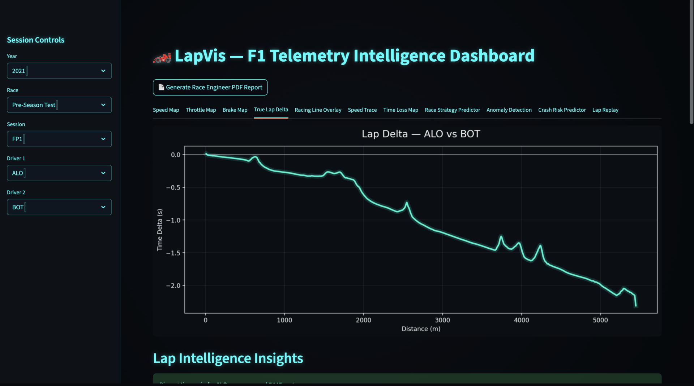
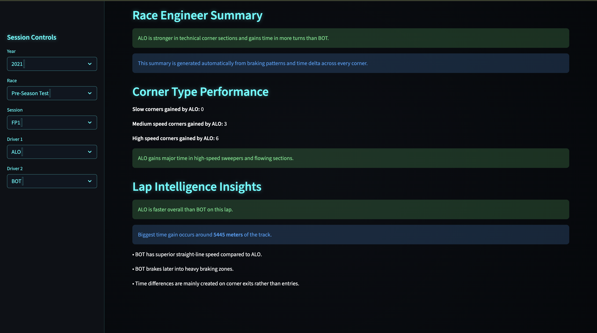
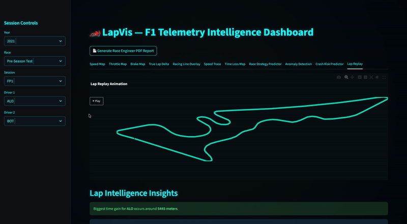

## 🏎️ LapVis — F1 Telemetry Intelligence Dashboard

LapVis is a telemetry intelligence system built on real Formula 1 session data.
It reconstructs the lap in space, compares drivers meter-by-meter, and extracts race-engineer level insights from raw telemetry.

Built with: FastF1 • Python • NumPy • Matplotlib • Plotly • Streamlit • Three.js

⸻

 ## Cinematic Landing (Three.js)

 

A broadcast-style WebGL landing inspired by F1 TV graphics that transitions into the telemetry dashboard.

⸻

 ## Dashboard Demo (Telemetry in Action)

 

Works for any race from 2021–2025 and provides:
	•	Speed Map (spatial)
	•	Throttle Map (spatial)
	•	Brake Map (spatial)
	•	True Lap Delta (time-aligned)
	•	Racing Line Overlay
	•	Speed Trace Comparison
	•	Time Loss Map
	•	Corner-by-Corner Insights
	•	Lap Replay Animation

⸻

 ## Insight Layer (Beyond Graphs)

 

LapVis explains:
	•	Where time was gained/lost
	•	How throttle & braking affect lap time
	•	Racing line differences
	•	Corner performance impact

⸻

 ## Spatial Telemetry Summary

 

Telemetry projected onto the actual circuit layout using GPS coordinates from FastF1.

⸻

 ## Lap Replay Animation

 

Real telemetry coordinates animated to visually replay the lap using hundreds of telemetry frames.

⸻

✨ Features at a Glance
	•	Uses FastF1 telemetry (~10Hz sampling) for real lap reconstruction
	•	~99% spatial alignment accuracy via GPS telemetry resampling
	•	Millisecond-level lap delta alignment using distance-time interpolation
	•	Meter-resolution racing line comparison between drivers
	•	Visualizes 7+ telemetry channels: X, Y, Speed, Throttle, Brake, Time, Distance
	•	Supports FP1 / FP2 / FP3 / Qualifying / Race / Sprint sessions
	•	Works across 2021–2025 seasons
	•	Generates per-corner performance insights
	•	Replays laps using per-sample telemetry animation
	•	Combines spatial + temporal telemetry analysis in one system

⸻

🏗️ Architecture Overview

            FastF1 Session
                  │
                  ▼
   Telemetry Extraction (X, Y, Speed, Throttle, Brake, Time, Distance)
                  │
                  ▼
     Distance-Aligned Interpolation (Driver vs Driver)
                  │
                  ▼
     Spatial Circuit Reconstruction using GPS telemetry
                  │
                  ▼
      Time Delta Computation (millisecond alignment)
                  │
                  ▼
     Visualization Layer (Matplotlib / Plotly)
                  │
                  ▼
         Interactive Dashboard (Streamlit)
                  │
                  ▼
        Cinematic Entry Interface (Three.js HUD)

⸻

 Technology Used

Category	        Tools / Libraries	           Purpose
Telemetry Source	FastF1	                    Access official F1 telemetry, GPS, timing
Data Processing	    Python, NumPy	            Telemetry alignment, interpolation, delta computation
Web Dashboard	    Streamlit	                Interactive UI, controls, insights
Frontend Landing	HTML, CSS, Three.js	        Cinematic HUD, animated grid
Graphics	        Matplotlib PathEffects	    Broadcast-style neon/glow plots
Caching	            FastF1 Cache                         	Fast session switching

⸻

▶ Run Locally

git clone <your-repo>
cd lapvis
python3 -m venv venv
source venv/bin/activate
pip install -r requirements.txt
streamlit run app.py

Open index.html → Enter Dashboard

⸻

 Future Scope

LapVis is built as a telemetry analysis engine, and the current dashboard is just the first interface layer. The same core can be extended into:
	•AI Race Strategy Predictor using historical lap, tyre and stint data
	•Driver Performance & Anomaly Detection combining telemetry + computer vision
	• Full race replay with multiple drivers simultaneously
	• Web deployment with live selectable sessions
	• Plugin architecture for adding new telemetry analytics modules
	• Machine learning models trained on telemetry patterns

⸻

 What Makes LapVis Different

Most projects: plot speed vs time
LapVis: reconstructs the lap in space and explains performance like an F1 engineer.

⸻

📜 Note

Telemetry via FastF1 is used strictly for educational and analytical purposes.

⸻

Author

Samiksha Tiwari
Computer Science Student 